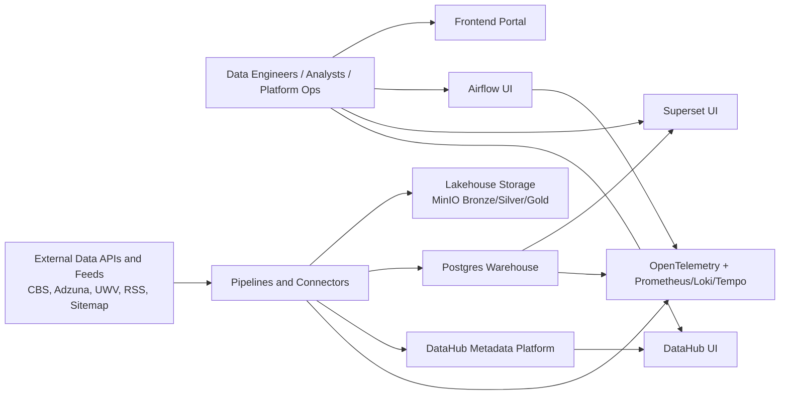
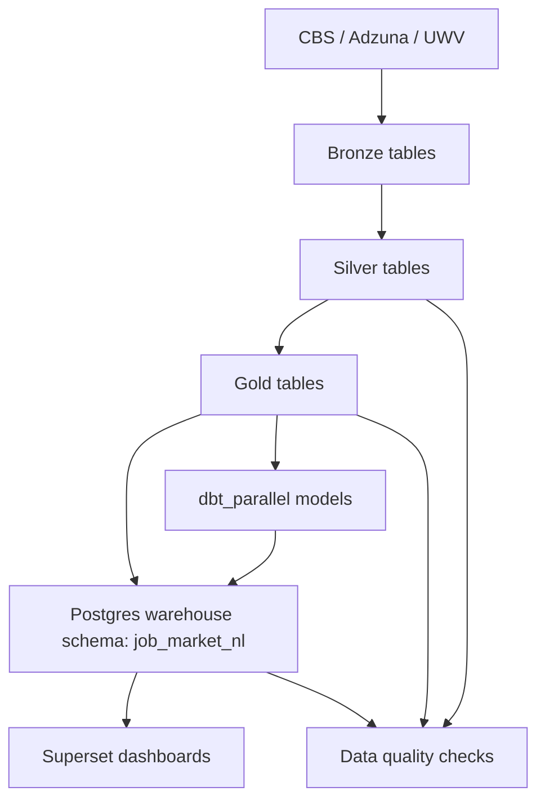
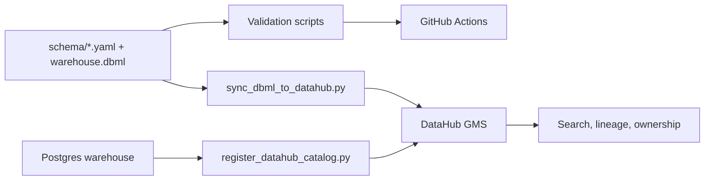

# Architecture

## Purpose
This document explains how Open Data Platform is structured, how data flows through it, and where each major responsibility lives.

## Problem and Scope
The platform solves a common analytics delivery problem: ingesting external and internal data, transforming it into trusted datasets, publishing metadata, and serving decision-ready outputs.

In-scope:
- Batch ingestion and transformation
- Metadata and lineage publication
- BI serving and operator workflows
- Platform observability and QA controls

Out-of-scope:
- Real-time event streaming as a first-class pipeline pattern
- Multi-tenant isolation model
- Production-grade HA guarantees for all services

## System Context

## Component View
### Operator Plane
- `frontend/`: React launchpad linking all platform surfaces
- `/platform` launchpad section "Logging, monitoring and tracing" links Grafana, Prometheus, and Alertmanager
- `/architecture` and `/services` pages expose the same observability links for consistent operator access
- Airflow UI: DAG operations and task-level monitoring
- DataHub UI: metadata catalog and lineage exploration
- Superset UI: BI dashboards and ad hoc query surface
- Grafana: observability dashboards

### Control Plane
- `dags/`: orchestration definitions
- Airflow scheduler/webserver/init jobs
- QA suites in `tests/` for quality, contracts, governance, and E2E validation

### Data Plane
- MinIO:
  - `bronze`, `silver`, `gold` buckets for medallion layering
- Postgres warehouse:
  - serving tables and dbt outputs
- DataHub:
  - GMS + Kafka + Elasticsearch + MySQL for metadata operations

### Supporting Plane
- Observability stack in `ops/observability/`
- Keycloak realm and SSO config in `ops/keycloak/`

## Runtime Data Flow
The primary domain flow implemented today is `job_market_nl`.

## Metadata and Governance Flow

## Deployment Model
- Local development:
  - Docker Compose (`docker-compose.yml`)
- Local Kubernetes dev-like:
  - kind cluster via `scripts/k8s/k8s_dev_up.sh`
- Cloud dev-like:
  - AKS provisioning/deploy via `scripts/aks/aks_up.sh`

More detail: [DEPLOYMENT.md](DEPLOYMENT.md)

## Key Integration Points
- External sources:
  - CBS OData APIs
  - Adzuna Jobs API
  - UWV Open Match feed
  - RSS/Sitemap job connectors
- Identity:
  - Keycloak OIDC for Airflow, DataHub, MinIO
- Observability:
  - OTEL export from pipeline runtime to collector and telemetry backends

## Architecture Decisions (Current)
- Keep both Spark-compatible and Postgres/dbt-native transformation paths.
- Use schema-as-code plus QA policy checks as governance baseline.
- Favor composable OSS services instead of tightly coupled platform products.
