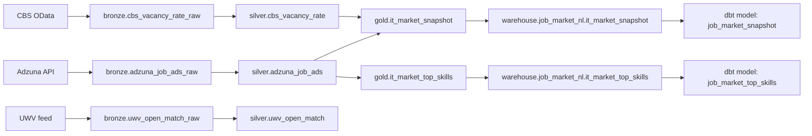

# Data Model

## Modeling Strategy
The platform uses a medallion model with domain-scoped tables:
- Bronze: source-aligned ingestion tables
- Silver: normalized/cleaned business entities
- Gold: analytics-ready aggregates and serving entities

Primary domain currently implemented: `job_market_nl`.

## Lakehouse Entities (`job_market_nl`)
### Bronze
- `cbs_vacancy_rate_raw`
- `cbs_vacancy_rate_dim_sic2008`
- `cbs_vacancy_rate_dim_periods`
- `adzuna_job_ads_raw`
- `uwv_open_match_raw`

### Silver
- `cbs_vacancy_rate`
- `adzuna_job_ads`
- `uwv_open_match`

### Gold
- `it_market_snapshot`
- `it_market_top_skills`

Gold tables are exported to the warehouse for BI consumption.

## Warehouse Serving Schema (`job_market_nl`)
The Postgres pipeline creates and refreshes these serving tables:

### `it_market_snapshot`
- `period_key` (TEXT, required)
- `period_label` (TEXT)
- `sector_name` (TEXT)
- `vacancies` (DOUBLE PRECISION)
- `vacancy_rate` (DOUBLE PRECISION)
- `job_ads_count` (INTEGER, required)
- `loaded_at` (TIMESTAMPTZ, default `now()`)

### `it_market_top_skills`
- `skill` (TEXT, required)
- `count` (INTEGER, required)
- `loaded_at` (TIMESTAMPTZ, default `now()`)

### `it_market_region_distribution`
- `region` (TEXT, required)
- `job_ads_count` (INTEGER, required)
- `share_pct` (DOUBLE PRECISION, required)
- `latitude` (DOUBLE PRECISION, required)
- `longitude` (DOUBLE PRECISION, required)
- `loaded_at` (TIMESTAMPTZ, default `now()`)

### `it_market_job_ads_geo`
- `job_id` (TEXT, required)
- `region` (TEXT, required)
- `latitude` (DOUBLE PRECISION, required)
- `longitude` (DOUBLE PRECISION, required)
- `location_label` (TEXT)
- `loaded_at` (TIMESTAMPTZ, default `now()`)

## dbt Parallel Model Layer
`dbt_parallel/` provides SQL-native models over serving sources:
- Model: `job_market_snapshot` <- source `job_market_nl.it_market_snapshot`
- Model: `job_market_top_skills` <- source `job_market_nl.it_market_top_skills`

This enables dbt testing/snapshots and supports parity checks against Python/Spark flows.

## Governance Metadata
Schema and governance artifacts live in `schema/`:
- `warehouse.dbml`: physical schema baseline
- `glossary.yaml`: business terms
- `metrics.yaml`: canonical KPI definitions
- `data_quality_rules.yaml`: centralized rule definitions
- `standards.md`: modeling quality conventions

## Data Quality and Contracts
Contract and policy checks are config-driven:
- Dataset contracts: `tests/configs/datasets/*.yml`
- Governance policies: `tests/configs/policies/governance_policies.yml`
- Environment behavior: `tests/configs/environments.yml`

Execution paths:
- `make dq-check DATASET=job_market_nl.job_market_snapshot`
- `make qa-test`
- `make test-e2e`

## Logical Lineage

