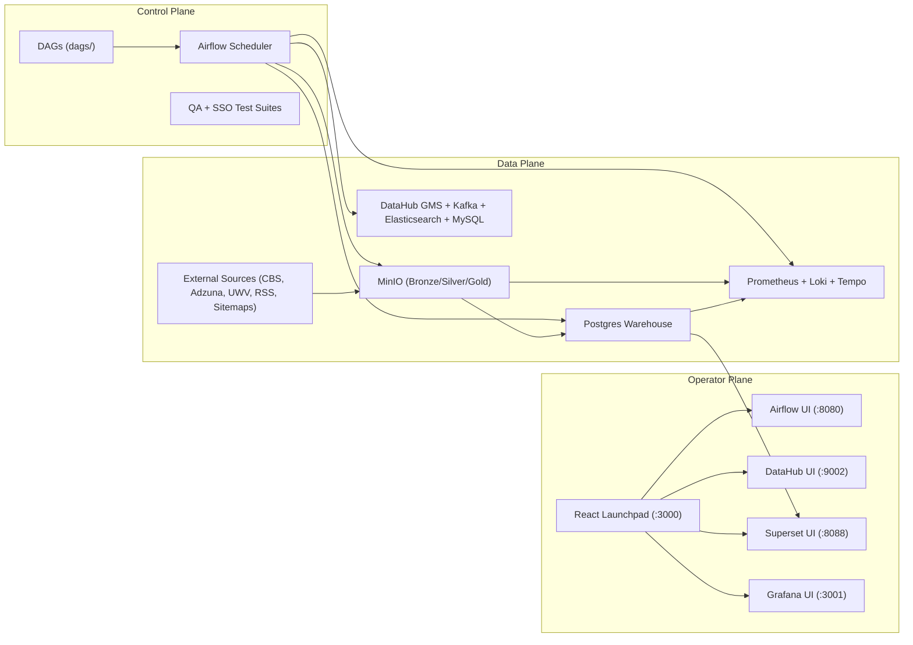

# Open Data Platform

An open, developer-first data platform that combines orchestration, lakehouse processing, governance, BI, and observability in one stack.

## What This Project Is
Open Data Platform is a reference implementation for running analytics workloads end to end:

- Ingest and transform data through medallion layers (Bronze -> Silver -> Gold)
- Orchestrate jobs with Airflow
- Serve analytics from Postgres and Superset
- Track metadata and lineage in DataHub
- Monitor metrics, logs, and traces with Prometheus + Grafana + Loki + Tempo
- Expose all operator surfaces through a React launchpad (`frontend/`)

## Core Features
- Hybrid pipeline runtime:
  - Spark/Fabric-compatible pipelines in `pipelines/`
  - Postgres-only fallback pipeline for local execution without Java/Spark
- Governance and quality:
  - Schema-as-code in `schema/`
  - Config-driven data quality and governance checks
  - E2E QA suite with evidence artifacts
- Deployment flexibility:
  - Local Docker Compose stack
  - Local Kubernetes (kind)
  - Azure Kubernetes Service (AKS)
- Security and identity:
  - Keycloak-based SSO flows for Airflow, DataHub, and MinIO
  - Dedicated SSO test suite and reports

## Architecture Overview
The platform is composed of three planes: control plane, data plane, and operator plane.



## Key Concepts
- Medallion flow:
  - Bronze: raw ingestion
  - Silver: cleaned and standardized datasets
  - Gold: analytics-ready aggregates
- Dual transformation path:
  - Python/Spark pipelines for richer processing and Fabric compatibility
  - dbt project (`dbt_parallel/`) for SQL-native transformations and tests
- Metadata and governance:
  - DataHub registration scripts publish schema, tags, and lineage
  - Governance policies and contract checks live under `tests/configs/`

## Repository Structure
```text
airflow/                 Airflow image and web auth config
dags/                    Orchestration DAGs
pipelines/               Domain pipeline logic (job_market_nl)
shared/                  Shared runtime/config/connectors/utilities
scripts/                 Bootstrap, QA, governance, and ops scripts
dbt_parallel/            Parallel dbt project and seeds
schema/                  DBML, glossary, metrics, DQ rules
tests/                   Unit, integration, governance, E2E, SSO suites
frontend/                Operator launchpad and architecture UI
docs/                    Supporting docs and diagrams
guides/                  Additional implementation guides
k8s/                     kind and AKS manifests
ops/                     Keycloak realm + observability configs
```

## Quick Start
### Prerequisites
- Python `3.9+`
- Docker + Docker Compose
- Make
- Node.js `18+` (only needed for standalone frontend development)

### 1) Bootstrap environment
```bash
cp .env.template .env
python3 -m venv .venv
source .venv/bin/activate
make dev-install
```

### 2) Start the local platform stack
Option A (recommended, full bootstrap including seed/setup):
```bash
./scripts/platform/bootstrap_all.sh --auto-fill-env
```

Option B (just services):
```bash
docker compose up -d
```

Optional notebook workspace:
```bash
docker compose up -d jupyter
```

### 3) Run a pipeline
Postgres-only end-to-end job market pipeline:
```bash
make run-job-market
```

Run a specific pipeline entrypoint:
```bash
LOCAL_MOCK_PIPELINES=false make run PIPELINE=job_market_nl.bronze_cbs_vacancy_rate
```

### 4) Run tests
```bash
make test
make qa-test
make test-e2e
make test-sso
```

## Configuration
Main configuration lives in `.env` (see `.env.template`).

Key groups:
- Runtime and storage:
  - `IS_LOCAL`, `USE_MINIO`, `LOCAL_LAKEHOUSE_PATH`
- Service credentials:
  - `AIRFLOW_*`, `WAREHOUSE_*`, `MINIO_*`, `SUPERSET_*`, `DATAHUB_*`
- SSO/identity:
  - `KEYCLOAK_*`, `MINIO_OIDC_REDIRECT_URI`
- Observability:
  - `OTEL_*`, `GRAFANA_ADMIN_*`, `ALERT_TEAMS_WEBHOOK_URL`
- Connector controls:
  - `JOB_CONNECTORS_*`, `CONNECTOR_RSS_*`, `CONNECTOR_SITEMAP_*`

Do not commit secrets in `.env`.

## Development
For local workflows, coding standards, and extension patterns:

- [DEVELOPMENT.md](DEVELOPMENT.md)

## Deployment
For Docker Compose, kind, and AKS deployment flows:

- [DEPLOYMENT.md](DEPLOYMENT.md)

## Data Model
For medallion entities, serving tables, and governance metadata:

- [DATA_MODEL.md](DATA_MODEL.md)

## Architecture Deep Dive
For component-level architecture and runtime flows:

- [ARCHITECTURE.md](ARCHITECTURE.md)

## Roadmap (Inferred)
- Expand beyond `job_market_nl` into additional governed domains
- Increase dbt model parity with Python/Spark transformations
- Harden AKS path from dev-like to production-grade defaults
- Add more automated lineage and policy gates in CI

## Contributing
1. Create a branch for your change.
2. Run local quality gates:
   - `make lint`
   - `make test`
   - `make schema-validate`
3. For platform-impacting changes, run:
   - `make qa-test`
   - `make test-e2e`
4. Open a PR with a clear scope and validation notes.
