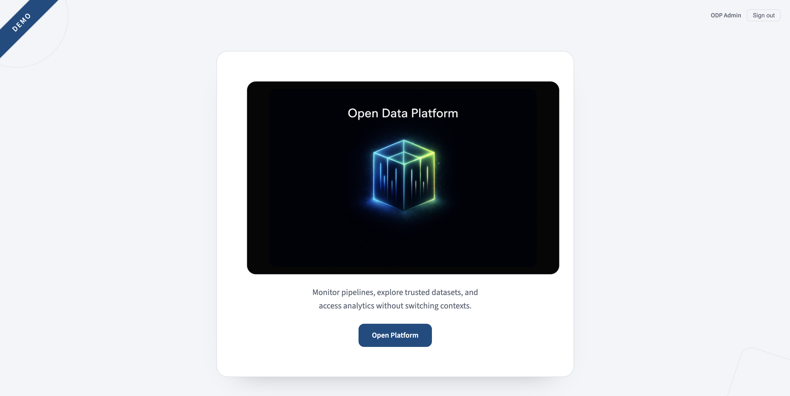

# Open Data Platform

Open Data Platform is a developer-first analytics platform that combines ingestion, transformation, orchestration, governance, BI, and observability in one stack.



## What This Project Is
Open Data Platform is a reference implementation for running analytics workloads end to end:

## What This Repository Provides
- End-to-end batch pipelines with medallion layering (`bronze -> silver -> gold`)
- Airflow orchestration for ingestion and transformation workflows
- dbt + Postgres serving models for analytics
- Metadata and lineage with DataHub
- Observability with Prometheus, Grafana, Loki, and Tempo
- A React launchpad (`frontend/`) that links all platform surfaces

## Quick Start (Local)
### Prerequisites
- Python `3.9+`
- Docker + Docker Compose
- Make

### Bootstrap and start
```bash
cp .env.template .env
python3 -m venv .venv
source .venv/bin/activate
make dev-install
./scripts/platform/bootstrap_all.sh --auto-fill-env
```

### Run a pipeline and quality gates
```bash
make run-job-market
make qa-test
```

### Key local endpoints
- Frontend launchpad: `http://localhost:3000`
- Airflow: `http://localhost:8080`
- Superset: `http://localhost:8088`
- DataHub: `http://localhost:9002`
- dbt docs: `http://localhost:8089`

Key groups:
- Runtime and storage:
  - `IS_LOCAL`, `USE_MINIO`, `LOCAL_LAKEHOUSE_PATH`
- Frontend links:
  - `VITE_DBT_DOCS_URL`, `DBT_DOCS_PUBLIC_URL`, `VITE_SHOW_DEMO_RIBBON`, `VITE_DEMO_AUTO_ADMIN`, `VITE_DEMO_USERNAME`
- Service credentials:
  - `AIRFLOW_*`, `WAREHOUSE_*`, `MINIO_*`, `SUPERSET_*`, `DATAHUB_*`
  - `SP1_*` (required for `source_sp1_vacatures_ingestion`)
- Security-sensitive controls:
  - `MINIO_SSO_BRIDGE_SESSION_SECRET` must be set to a strong secret (32+ chars)
  - `SUPERSET_OAUTH_DEFAULT_ROLE` defaults to `Gamma` (least privilege)
  - `SUPERSET_ALLOW_AUTO_ADMIN_ROLE=true` is required before allowing OAuth auto-registration into Superset `Admin`
- SSO/identity:
  - `KEYCLOAK_*`, `KEYCLOAK_DEMO_AUTO_LOGIN`, `KEYCLOAK_DEMO_AUTOLOGIN_USERNAME`, `MINIO_OIDC_REDIRECT_URI`
- Observability:
  - `OTEL_*`, `GRAFANA_ADMIN_*`, `ALERT_TEAMS_WEBHOOK_URL`
- Connector controls:
  - `JOB_CONNECTORS_*`, `CONNECTOR_RSS_*`, `CONNECTOR_SITEMAP_*`
  
## Architecture Overview
The platform is organized into three planes:
- Operator plane: React launchpad + service UIs (Airflow, Superset, DataHub, Grafana)
- Control plane: Airflow DAGs, scheduling, and quality/test orchestration
- Data plane: source connectors, MinIO lakehouse, Postgres warehouse, DataHub metadata, observability backends

Detailed diagrams and flow breakdowns are in [ARCHITECTURE.md](ARCHITECTURE.md).

## Documentation Map
Use this page as the index and go deeper in the docs below.

| Topic | Document |
|---|---|
| Local development workflow, daily commands, coding standards | [DEVELOPMENT.md](DEVELOPMENT.md) |
| Deployments (Docker Compose, kind, AKS), env and secrets | [DEPLOYMENT.md](DEPLOYMENT.md) |
| Component boundaries, runtime flow, governance flow | [ARCHITECTURE.md](ARCHITECTURE.md) |
| Medallion entities, serving models, lineage | [DATA_MODEL.md](DATA_MODEL.md) |
| Security rules and secret-handling checklist | [SECURITY.md](SECURITY.md), [GIT_SECURITY_CHECKLIST.md](GIT_SECURITY_CHECKLIST.md) |
| Add a new ingestion source end-to-end | [docs/INGESTION_GUIDE.md](docs/INGESTION_GUIDE.md) |
| Data quality framework usage and rollout | [guides/data_quality_framework.md](guides/data_quality_framework.md) |
| Platform E2E testing workflow | [docs/e2e_data_platform_testing.md](docs/e2e_data_platform_testing.md) |
| CI/CD assumptions, decisions, checks, and runbooks | [docs/cicd/RUNBOOKS.md](docs/cicd/RUNBOOKS.md) |

## Repository Structure
```text
airflow/         Airflow image and web auth config
dags/            Orchestration DAGs
src/             Ingestion framework and source modules
pipelines/       Domain pipeline logic
shared/          Shared runtime/config/connectors
scripts/         Bootstrap, QA, governance, ops scripts
dbt_parallel/    dbt project, models, seeds, templates
schema/          Contracts, DBML, glossary, DQ rules
tests/           Unit, integration, governance, E2E, SSO suites
frontend/        Operator launchpad
k8s/             kind and AKS manifests
ops/             Keycloak and observability configs
```

## Contributing
1. Create a branch for your change.
2. Run the default quality gates:
   - `make lint`
   - `make test`
   - `make schema-validate`
3. For platform-impacting changes, also run:
   - `make qa-test`
   - `make test-e2e`

## License
This project is licensed under the [MIT License](LICENSE).

Third-party runtime components used by the platform keep their own licenses.
See [THIRD_PARTY_LICENSES.md](THIRD_PARTY_LICENSES.md) for the current inventory and compliance notes.
