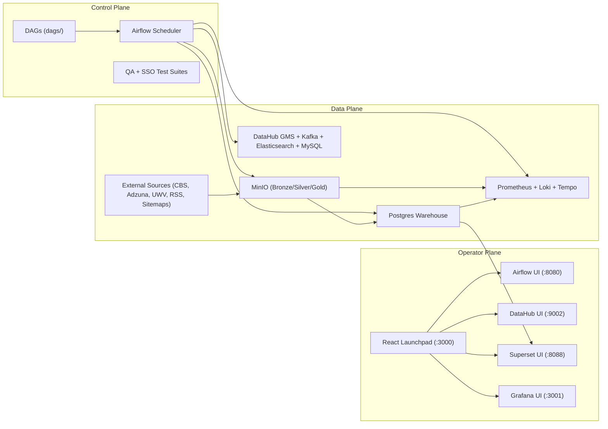

# Open Data Platform

Open Data Platform is a fully open-source, developer-first analytics platform that combines ingestion, transformation, orchestration, governance, BI, and observability in one stack.


## Github Pages documentation page:
https://fresh-minds.github.io/FreshDataPlatform/

## What This Repository Provides
- End-to-end batch pipelines with medallion layering (`bronze -> silver -> gold`)
- Airflow orchestration for ingestion and transformation workflows
- dbt + Postgres serving models for analytics
- Metadata and lineage with DataHub
- Observability with Prometheus, Grafana, Loki, and Tempo
- React launchpad (`frontend/`) for platform access and operations

## Core Features
- Hybrid pipeline runtime:
  - Spark/Fabric-compatible pipelines in `pipelines/`
  - Postgres-only fallback pipeline for local execution without Java/Spark
- Governance and quality:
  - Schema-as-code in `schema/`
  - Config-driven quality and governance checks
  - E2E QA suite with evidence artifacts
- Deployment flexibility:
  - Local Docker Compose
  - Local Kubernetes (kind)
  - AKS and Scaleway Kubernetes
- Security and identity:
  - Keycloak-based SSO flows for Airflow, DataHub, and MinIO
  - Dedicated SSO test suite and reports

## Architecture Overview
The platform is composed of three planes: operator plane, control plane, and data plane.


```mermaid
flowchart LR
  subgraph OperatorPlane[Operator Plane]
    Portal["React Launchpad (:3000)"]
    AirflowUI["Airflow UI (:8080)"]
    DataHubUI["DataHub UI (:9002)"]
    SupersetUI["Superset UI (:8088)"]
    GrafanaUI["Grafana UI (:3001)"]
  end

  subgraph ControlPlane[Control Plane]
    Scheduler["Airflow Scheduler"]
    DAGs["DAGs (dags/)"]
    Tests["QA + SSO Test Suites"]
  end

  subgraph DataPlane[Data Plane]
    Sources["External Sources (CBS, Adzuna, UWV, RSS, Sitemaps)"]
    MinIO["MinIO (Bronze/Silver/Gold)"]
    Warehouse["Postgres Warehouse"]
    DataHub["DataHub GMS + Kafka + Elasticsearch + MySQL"]
    O11y["Prometheus + Loki + Tempo"]
  end

  Portal --> AirflowUI
  Portal --> DataHubUI
  Portal --> SupersetUI
  Portal --> GrafanaUI

  DAGs --> Scheduler
  Scheduler --> MinIO
  Scheduler --> Warehouse
  Scheduler --> DataHub

  Sources --> MinIO
  MinIO --> Warehouse
  Warehouse --> SupersetUI

  Scheduler --> O11y
  MinIO --> O11y
  Warehouse --> O11y
```

See [ARCHITECTURE.md](ARCHITECTURE.md) for deeper runtime and component details.

## Quick Start (Local)

### Prerequisites
- Python `3.9+`
- Docker + Docker Compose
- Make

### Bootstrap
```bash
cp .env.template .env
python3 -m venv .venv
source .venv/bin/activate
make dev-install
./scripts/platform/bootstrap_all.sh --auto-fill-env
```

Notes:
- `bootstrap_all.sh` creates `.venv` if missing and repairs broken interpreter links.
- Bootstrap installs dependencies with `pip install -e ".[dev,pipeline]"`.
- Use `--skip-dev-install` only when you manage dependencies manually.
- dbt bootstrap uses `DBT_THREADS=1` by default to reduce Postgres deadlocks.

### Start Services
Full local stack:
```bash
docker compose up -d
```

Minimal local stack (no DataHub, no heavy observability, no jupyter):
```bash
make compose-up-minimal
```

Minimal mode notes:
- Uses `docker-compose.minimal.yml`.
- Seeds `ODP Staffing Demand` and `Platform Metadata Operations` dashboards.
- Runs `scripts/testing/verify_compose_minimal.sh` by default.
- Set `COMPOSE_MINIMAL_SMOKE_AFTER_UP=false` to skip smoke checks.

Optional notebook workspace:
```bash
docker compose up -d jupyter
```

### Run Pipelines
Canonical Postgres-only pipeline:
```bash
make run-odp-staffing-demand
make run-odp-staffing-demand-metadata
```

Run a specific entrypoint:
```bash
LOCAL_MOCK_PIPELINES=false make run PIPELINE=odp_staffing_demand.bronze_cbs_vacancy_rate
```

### Run Tests
```bash
make test
make qa-test
```

### Local Endpoints
- Frontend launchpad: `http://localhost:3000`
- Airflow: `http://localhost:8080`
- Superset: `http://localhost:8088`
- DataHub: `http://localhost:9002`
- dbt docs: `http://localhost:8089`

## dbt Docs and Metadata Operations
Generate and host dbt docs:
```bash
make dbt-docs-refresh
```

Watch dbt docs and lineage updates during development:
```bash
make dbt-docs-watch
```

Initialize metadata tables:
```bash
make warehouse-metadata-init
```

## Deployment Shortcuts
For complete deployment guidance, use [DEPLOYMENT.md](DEPLOYMENT.md). Common shortcuts are below.

AKS deploy:
```bash
make k8s-aks-up
```

AKS deploy with Key Vault as secret source:
```bash
AKS_KEY_VAULT_NAME=aitrialkv1234abcd make k8s-aks-up
```

AKS deploy with direct `.env` to Kubernetes secret sync:
```bash
AKS_USE_KEY_VAULT=false make k8s-aks-up
```

AKS image-only update:
```bash
make k8s-aks-update-images
```

Limit AKS image updates to selected services:
```bash
AKS_IMAGES=frontend,portal-api make k8s-aks-update-images
```

Scaleway redeploy (full/minimal):
```bash
make scaleway-redeploy-all
make scaleway-redeploy-all-minimal
```

Scaleway note:
- Deploy/destroy scripts can fall back to `.env` for `SCW_ACCESS_KEY`, `SCW_SECRET_KEY`, and `SCW_DEFAULT_PROJECT_ID` when these are not exported.
- Set `SKIP_IMAGE_BUILD=true` for config-only redeploy iterations.

## Superset Mapbox Setup
Required for map dashboards:

```bash
echo 'MAPBOX_API_KEY=<your-mapbox-public-token>' >> .env
docker compose up -d --force-recreate superset
```

Verification:

```bash
docker exec open-data-platform-superset sh -lc 'python -c "import os; print(bool(os.getenv(\"MAPBOX_API_KEY\")))"'
```

## Repository Structure
```text
airflow/         Airflow image and web auth config
dags/            Orchestration DAGs
src/             Ingestion framework and source modules
pipelines/       Domain pipeline logic
shared/          Shared runtime, config, connectors
scripts/         Bootstrap, QA, governance, and ops scripts
dbt/             dbt project, models, seeds, and templates
schema/          Contracts, DBML, glossary, and DQ rules
tests/           Unit, integration, governance, E2E, and SSO suites
frontend/        Operator launchpad
k8s/             kind and AKS manifests
deploy/          Kustomize deployment manifests
ops/             Keycloak and observability configurations
docs/            Supporting docs and diagrams
guides/          Topic-specific implementation guides
```

## Documentation Map
| Topic | Document |
|---|---|
| Development workflow and coding standards | [DEVELOPMENT.md](DEVELOPMENT.md) |
| Deployment modes, env, and secrets | [DEPLOYMENT.md](DEPLOYMENT.md) |
| Runtime architecture and component boundaries | [ARCHITECTURE.md](ARCHITECTURE.md) |
| Medallion entities and serving model details | [DATA_MODEL.md](DATA_MODEL.md) |
| Security and secret handling | [SECURITY.md](SECURITY.md), [GIT_SECURITY_CHECKLIST.md](GIT_SECURITY_CHECKLIST.md) |
| Ingestion onboarding guide | [docs/INGESTION_GUIDE.md](docs/INGESTION_GUIDE.md) |
| Data quality framework | [guides/data_quality_framework.md](guides/data_quality_framework.md) |
| End-to-end platform testing | [docs/e2e_data_platform_testing.md](docs/e2e_data_platform_testing.md) |
| CI/CD runbooks | [docs/cicd/RUNBOOKS.md](docs/cicd/RUNBOOKS.md) |

## Adding a New Ingestion Source
- Guide: [docs/INGESTION_GUIDE.md](docs/INGESTION_GUIDE.md)
- Python templates: `src/ingestion/_template/`
- DAG template: `dags/_template_dag.py`
- dbt model templates: `dbt/_model_templates/`

## Security Reminder
Do not commit real credentials, tokens, or private keys. Use `.env` (ignored by git) and keep `.env.template` placeholder-only.

## Contributing
See [CONTRIBUTING.md](CONTRIBUTING.md) for branch workflow, required checks, DCO sign-off, and third-party license guardrails.

## License
This project is licensed under the MIT License. See [LICENSE](LICENSE).

Third-party runtime components keep their own licenses. See [THIRD_PARTY_LICENSES.md](THIRD_PARTY_LICENSES.md).
