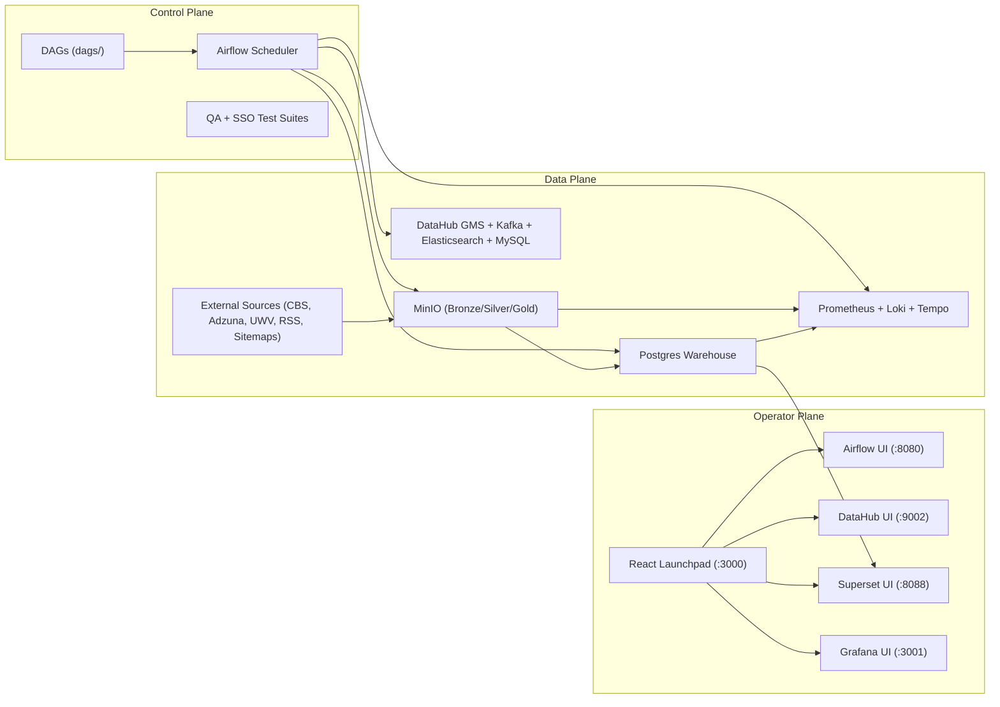

# Open Data Platform

Open Data Platform is a developer-first analytics platform that combines ingestion, transformation, orchestration, governance, BI, and observability in one stack.


## What This Project Is
Open Data Platform is a reference implementation for running analytics workloads end to end:

## What This Repository Provides
- End-to-end batch pipelines with medallion layering (`bronze -> silver -> gold`)
- Airflow orchestration for ingestion and transformation workflows
- dbt + Postgres serving models for analytics
- Metadata and lineage with DataHub
- Observability with Prometheus, Grafana, Loki, and Tempo
- A React launchpad (`frontend/`) that links all platform surfaces

<<<<<<< HEAD
## Quick Start (Local)
=======
## Core Features
- Hybrid pipeline runtime:
  - Spark/Fabric-compatible pipelines in `pipelines/`
  - Postgres-only fallback pipeline for local execution without Java/Spark
- Governance and quality:
  - Schema-as-code in `schema/`
  - Config-driven data quality and governance checks
  - E2E QA suite with evidence artifacts
- Deployment flexibility:
  - Local Docker Compose stack
  - Local Kubernetes (kind)
  - Azure Kubernetes Service (AKS)
- Security and identity:
  - Keycloak-based SSO flows for Airflow, DataHub, and MinIO
  - Dedicated SSO test suite and reports
- Operator UX consistency:
  - Frontend `/platform`, `/architecture`, and `/services` provide aligned observability links (Grafana, Prometheus, Alertmanager)
  - Frontend `/platform` includes `docs and horizontal technical lineage` linking to dbt docs (`dbt docs & lineage`)
  - Admin-only frontend `/admin/login-metadata` shows pre-login homepage visit counters linked to post-login user metadata
  - Admin metadata also includes per-page route visit counters and per-API-endpoint hit counters
  - Admin users can clear stored portal login metadata from `/admin/login-metadata`

## Architecture Overview
The platform is composed of three planes: control plane, data plane, and operator plane.


```mermaid
flowchart LR
  subgraph OperatorPlane[Operator Plane]
    Portal["React Launchpad (:3000)"]
    AirflowUI["Airflow UI (:8080)"]
    DataHubUI["DataHub UI (:9002)"]
    SupersetUI["Superset UI (:8088)"]
    GrafanaUI["Grafana UI (:3001)"]
  end

  subgraph ControlPlane[Control Plane]
    Scheduler["Airflow Scheduler"]
    DAGs["DAGs (dags/)"]
    Tests["QA + SSO Test Suites"]
  end

  subgraph DataPlane[Data Plane]
    Sources["External Sources (CBS, Adzuna, UWV, RSS, Sitemaps)"]
    MinIO["MinIO (Bronze/Silver/Gold)"]
    Warehouse["Postgres Warehouse"]
    DataHub["DataHub GMS + Kafka + Elasticsearch + MySQL"]
    O11y["Prometheus + Loki + Tempo"]
  end

  Portal --> AirflowUI
  Portal --> DataHubUI
  Portal --> SupersetUI
  Portal --> GrafanaUI

  DAGs --> Scheduler
  Scheduler --> MinIO
  Scheduler --> Warehouse
  Scheduler --> DataHub

  Sources --> MinIO
  MinIO --> Warehouse
  Warehouse --> SupersetUI

  Scheduler --> O11y
  MinIO --> O11y
  Warehouse --> O11y
```

## Key Concepts
- Medallion flow:
  - Bronze: raw ingestion
  - Silver: cleaned and standardized datasets
  - Gold: analytics-ready aggregates
- Dual transformation path:
  - Python/Spark pipelines for richer processing and Fabric compatibility
  - dbt project (`dbt/`) for SQL-native transformations and tests
- Metadata and governance:
  - DataHub registration scripts publish schema, tags, and lineage
  - Warehouse `platform_metadata` schema stores run/task/artifact/lineage/quality metadata events
  - `odp_staffing_demand_pipeline` is the canonical DAG ID; legacy `odp_staffing_demand_pipeline` delegates to it during migration
  - Governance policies and contract checks live under `tests/configs/`

## Repository Structure
```text
airflow/                 Airflow image and web auth config
dags/                    Orchestration DAGs
src/ingestion/           Source ingestion framework (common helpers + per-source modules)
  common/                Shared: source_config, postgres, dag_helpers, minio, provenance
  _template/             Python templates for new sources
  <source>/              Per-source config, extractor, parser
pipelines/               Domain pipeline logic (`odp_staffing_demand` canonical, `odp_staffing_demand` legacy compatibility)
shared/                  Shared runtime/config/connectors/utilities
scripts/                 Bootstrap, QA, governance, and ops scripts
dbt/            Parallel dbt project, seeds, and model templates
  _model_templates/      dbt model templates for new sources (bronze/silver/gold)
  models/                Active dbt models (bronze, silver, gold)
schema/                  DBML, glossary, metrics, DQ rules
tests/                   Unit, integration, governance, E2E, SSO suites
frontend/                Operator launchpad and architecture UI
docs/                    Supporting docs and diagrams
guides/                  Additional implementation guides
k8s/                     kind and AKS manifests
ops/                     Keycloak realm + observability configs
```

## Quick Start
>>>>>>> demo
### Prerequisites
- Python `3.9+`
- Docker + Docker Compose
- Make

### Bootstrap and start
```bash
cp .env.template .env
python3 -m venv .venv
source .venv/bin/activate
make dev-install
./scripts/platform/bootstrap_all.sh --auto-fill-env
```
<<<<<<< HEAD

### Run a pipeline and quality gates
```bash
make run-job-market
=======
`bootstrap_all.sh` will create `.venv` if missing, recreate it when the interpreter link is broken,
and install bootstrap dependencies via `pip install -e ".[dev,pipeline]"`.
Use `--skip-dev-install` only if you want to manage dependencies yourself.
During bootstrap dbt orchestration, `scripts/pipeline/run_dbt.sh` defaults to
`DBT_THREADS=1` to avoid Postgres deadlocks; override with `DBT_THREADS=<n>` when needed.
The default Superset bootstrap seeds committed dashboards, including
`ODP Staffing Demand`.
It also seeds a metadata-driven operations dashboard, `Platform Metadata Operations`,
from warehouse schema `platform_metadata`.

Option B (just services):
```bash
docker compose up -d
```

Minimal local stack (no DataHub, no heavy observability, no jupyter) with
seeded Superset dashboards:

```bash
make compose-up-minimal
```

This uses `docker-compose.minimal.yml` and seeds:
- `ODP Staffing Demand`
- `Platform Metadata Operations`

Option C (bare minimum services only, aligned with minimal Terraform deploy scope):
```bash
make compose-up-minimal
```

This starts a reduced local stack (no DataHub, no heavy observability, no jupyter)
using `docker-compose.minimal.yml`.
By default it also runs `scripts/testing/verify_compose_minimal.sh` at the end.
Set `COMPOSE_MINIMAL_SMOKE_AFTER_UP=false` to skip post-start smoke checks.

Optional notebook workspace:
```bash
docker compose up -d jupyter
```

Generate and host dbt docs locally:
```bash
make dbt-docs-refresh
```

Then open `http://localhost:8089` (or navigate from `/platform`).

Keep dbt docs and lineage auto-updated during development:
```bash
make dbt-docs-watch
```

Initialize platform metadata tables:
```bash
make warehouse-metadata-init
```

### 3) Run a pipeline
Postgres-only end-to-end ODP Staffing Demand pipeline:
```bash
make run-odp-staffing-demand
make run-odp-staffing-demand-metadata
```

Run a specific pipeline entrypoint:
```bash
LOCAL_MOCK_PIPELINES=false make run PIPELINE=odp_staffing_demand.bronze_cbs_vacancy_rate
```

### 4) Run tests
```bash
make test
>>>>>>> demo
make qa-test
```

### Key local endpoints
- Frontend launchpad: `http://localhost:3000`
- Airflow: `http://localhost:8080`
- Superset: `http://localhost:8088`
- DataHub: `http://localhost:9002`
- dbt docs: `http://localhost:8089`

Key groups:
- Runtime and storage:
  - `IS_LOCAL`, `USE_MINIO`, `LOCAL_LAKEHOUSE_PATH`
- Frontend links:
  - `VITE_DBT_DOCS_URL`, `DBT_DOCS_PUBLIC_URL`, `VITE_SHOW_DEMO_RIBBON`, `VITE_DEMO_AUTO_ADMIN`, `VITE_DEMO_USERNAME`
- Service credentials:
  - `AIRFLOW_*`, `WAREHOUSE_*`, `MINIO_*`, `SUPERSET_*`, `DATAHUB_*`
- Superset map rendering:
  - `MAPBOX_API_KEY` is required for Mapbox-backed charts (for example `deck_gl_heatmap`)
- Security-sensitive controls:
  - `MINIO_SSO_BRIDGE_SESSION_SECRET` must be set to a strong secret (32+ chars)
  - `SP1_SCRAPING_APPROVED` must be `true` before `source_sp1_vacatures_ingestion` will run
  - `SP1_ALLOWED_HOSTS` is recommended to restrict Source SP1 automation to approved domains
  - `SUPERSET_OAUTH_DEFAULT_ROLE` defaults to `Gamma` (least privilege)
  - `SUPERSET_ALLOW_AUTO_ADMIN_ROLE=true` is required before allowing OAuth auto-registration into Superset `Admin`
- SSO/identity:
  - `KEYCLOAK_*`, `KEYCLOAK_DEMO_USER_PASSWORD`, `KEYCLOAK_DEMO_AUTO_LOGIN`, `KEYCLOAK_DEMO_AUTOLOGIN_USERNAME`, `MINIO_OIDC_REDIRECT_URI`
- Observability:
  - `OTEL_*`, `GRAFANA_ADMIN_*`, `ALERT_TEAMS_WEBHOOK_URL`
- Connector controls:
  - `JOB_CONNECTORS_*`, `CONNECTOR_RSS_*`, `CONNECTOR_SITEMAP_*`
  
## Architecture Overview
The platform is organized into three planes:
- Operator plane: React launchpad + service UIs (Airflow, Superset, DataHub, Grafana)
- Control plane: Airflow DAGs, scheduling, and quality/test orchestration
- Data plane: source connectors, MinIO lakehouse, Postgres warehouse, DataHub metadata, observability backends

Detailed diagrams and flow breakdowns are in [ARCHITECTURE.md](ARCHITECTURE.md).

<<<<<<< HEAD
## Documentation Map
Use this page as the index and go deeper in the docs below.
=======
Superset Mapbox setup (required for map dashboards):

```bash
echo 'MAPBOX_API_KEY=<your-mapbox-public-token>' >> .env
docker compose up -d --force-recreate superset
```

Verification:

```bash
docker exec open-data-platform-superset sh -lc 'python -c "import os; print(bool(os.getenv(\"MAPBOX_API_KEY\")))"'
```

## Development
For local workflows, coding standards, and extension patterns:
>>>>>>> demo

| Topic | Document |
|---|---|
| Local development workflow, daily commands, coding standards | [DEVELOPMENT.md](DEVELOPMENT.md) |
| Deployments (Docker Compose, kind, AKS), env and secrets | [DEPLOYMENT.md](DEPLOYMENT.md) |
| Component boundaries, runtime flow, governance flow | [ARCHITECTURE.md](ARCHITECTURE.md) |
| Medallion entities, serving models, lineage | [DATA_MODEL.md](DATA_MODEL.md) |
| Security rules and secret-handling checklist | [SECURITY.md](SECURITY.md), [GIT_SECURITY_CHECKLIST.md](GIT_SECURITY_CHECKLIST.md) |
| Add a new ingestion source end-to-end | [docs/INGESTION_GUIDE.md](docs/INGESTION_GUIDE.md) |
| Data quality framework usage and rollout | [guides/data_quality_framework.md](guides/data_quality_framework.md) |
| Platform E2E testing workflow | [docs/e2e_data_platform_testing.md](docs/e2e_data_platform_testing.md) |
| CI/CD assumptions, decisions, checks, and runbooks | [docs/cicd/RUNBOOKS.md](docs/cicd/RUNBOOKS.md) |

## Repository Structure
```text
airflow/         Airflow image and web auth config
dags/            Orchestration DAGs
src/             Ingestion framework and source modules
pipelines/       Domain pipeline logic
shared/          Shared runtime/config/connectors
scripts/         Bootstrap, QA, governance, ops scripts
dbt_parallel/    dbt project, models, seeds, templates
schema/          Contracts, DBML, glossary, DQ rules
tests/           Unit, integration, governance, E2E, SSO suites
frontend/        Operator launchpad
k8s/             kind and AKS manifests
ops/             Keycloak and observability configs
```

<<<<<<< HEAD
=======
`make k8s-aks-up` runs this smoke verification automatically by default (`AKS_SMOKE_AFTER_UP` unset/empty = `true`); smoke HTTP checks retry for roughly 60 seconds per endpoint before failing. Set `AKS_SMOKE_AFTER_UP=false` to skip.

AKS secret source defaults to Azure Key Vault (seeded from `.env` and synced to Kubernetes secret `odp-env`):

```bash
AKS_KEY_VAULT_NAME=aitrialkv1234abcd make k8s-aks-up
```

If the AKS Key Vault provider add-on is already enabled, `make k8s-aks-up` now detects that state and continues without failing.
For Key Vault RBAC-enabled vaults, the signed-in Azure principal needs Key Vault secret write access (`Key Vault Secrets Officer` or `Key Vault Administrator`) to seed secrets.
Empty `.env` values are skipped for Key Vault sync because Azure Key Vault does not accept empty secret values.
AKS `.env` parsing strips one wrapping quote pair from values before Key Vault sync (for example `'uuid'` -> `uuid`).
Use `AKS_NODE_COUNT` to enforce minimum AKS System nodepool capacity during reruns (recommended `4` for full parity stack stability).

Disable Key Vault secret sync (fallback to direct `.env` -> Kubernetes secret):

```bash
AKS_USE_KEY_VAULT=false make k8s-aks-up
```

AKS fast image-only update (no infra/parity re-apply):

```bash
make k8s-aks-update-images
```

When `AKS_IMAGES` includes `airflow`, this also refreshes
`airflow-webserver-config` from `airflow/webserver_config.py` before the
Airflow rollout and refreshes the `dbt-docs` initContainer image.

Limit to specific services during iteration:

```bash
AKS_IMAGES=frontend,portal-api make k8s-aks-update-images
```

AKS rollout summary (label-aligned with deployment docs):
- **Provisioning and ingress**: cluster/resource setup, ingress-nginx, cert-manager, DNS/TLS wiring.
- **Image build and publish**: Airflow/frontend images plus parity-service images when enabled.
- **Core and parity rollout**: Key Vault-backed `odp-env` secret sync, core manifests, parity manifests, staged DataHub setup, dbt docs service rollout.
- **Airflow reliability hardening**: probe tuning, guarded init retries, conservative rollout settings.
- **DataHub and auth reliability hardening**: GMS cold-start probe hardening (socket startup + `/health` readiness/liveness with AKS tuning env overrides), staged rollout, ingress buffering for OIDC headers.
- **Config safety and URL consistency**: AKS URL rewriting, Keycloak config reconciliation, placeholder validation before apply.

Scaleway deploy convenience:
- `make scaleway-redeploy-all` and `make scaleway-redeploy-all-minimal` now
  resolve `--project-id` from `TF_PROJECT_ID`, then `SCW_DEFAULT_PROJECT_ID`,
  then `.env` (`SCW_DEFAULT_PROJECT_ID`) when not exported in the shell.
- Scaleway deploy/destroy scripts also load `SCW_ACCESS_KEY`, `SCW_SECRET_KEY`,
  and `SCW_DEFAULT_PROJECT_ID` from `.env` as fallbacks when missing in env.
- For faster redeploys, set `SKIP_IMAGE_BUILD=true` to reuse images already
  running in the cluster and skip Docker build/push (best for config-only
  rollout iterations).

## Data Model
For medallion entities, serving tables, and governance metadata:

- [DATA_MODEL.md](DATA_MODEL.md)

## Architecture Deep Dive
For component-level architecture and runtime flows:

- [ARCHITECTURE.md](ARCHITECTURE.md)

## Adding a New Ingestion Source

The platform includes a standardization framework for onboarding new data
sources with minimal boilerplate. Templates, generic helpers, and a step-by-step
guide are provided:

- [Data Ingestion Guide](docs/INGESTION_GUIDE.md) — end-to-end walkthrough
- Python templates: `src/ingestion/_template/`
- DAG template: `dags/_template_dag.py`
- dbt model templates: `dbt/_model_templates/`

## Roadmap (Inferred)
- Expand beyond `odp_staffing_demand` into additional governed domains
- Increase dbt model parity with Python/Spark transformations
- Harden AKS path from dev-like to production-grade defaults
- Add more automated lineage and policy gates in CI

>>>>>>> demo
## Contributing
See [CONTRIBUTING.md](CONTRIBUTING.md) for branch workflow, required checks, DCO sign-off, and third-party license guardrails.

## License
This project is licensed under the [MIT License](LICENSE).

Third-party runtime components used by the platform keep their own licenses.
See [THIRD_PARTY_LICENSES.md](THIRD_PARTY_LICENSES.md) for the current inventory and compliance notes.
