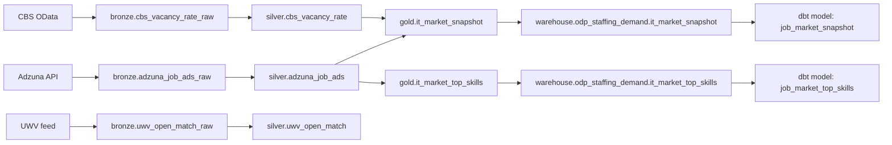

## Modeling Strategy

The platform uses a medallion model with domain-scoped tables:
- **Bronze**: source-aligned ingestion tables
- **Silver**: normalized/cleaned business entities
- **Gold**: analytics-ready aggregates and serving entities

Primary domain currently implemented: `odp_staffing_demand`.

## Lakehouse Entities (`odp_staffing_demand`)

### Bronze
- `cbs_vacancy_rate_raw`
- `cbs_vacancy_rate_dim_sic2008`
- `cbs_vacancy_rate_dim_periods`
- `adzuna_job_ads_raw`
- `uwv_open_match_raw`

### Silver
- `cbs_vacancy_rate`
- `adzuna_job_ads`
- `uwv_open_match`

### Gold
- `it_market_snapshot`
- `it_market_top_skills`

Gold tables are exported to the warehouse for BI consumption.

## Warehouse Serving Schema (`odp_staffing_demand`)

The Postgres pipeline creates and refreshes these serving tables:

### `it_market_snapshot`
| Column | Type | Notes |
|--------|------|-------|
| `period_key` | TEXT | Required |
| `period_label` | TEXT | |
| `sector_name` | TEXT | |
| `vacancies` | DOUBLE PRECISION | |
| `vacancy_rate` | DOUBLE PRECISION | |
| `job_ads_count` | INTEGER | Required |
| `loaded_at` | TIMESTAMPTZ | Default `now()` |

### `it_market_top_skills`
| Column | Type | Notes |
|--------|------|-------|
| `skill` | TEXT | Required |
| `count` | INTEGER | Required |
| `loaded_at` | TIMESTAMPTZ | Default `now()` |

### `it_market_region_distribution`
| Column | Type | Notes |
|--------|------|-------|
| `region` | TEXT | Required |
| `job_ads_count` | INTEGER | Required |
| `share_pct` | DOUBLE PRECISION | Required |
| `latitude` | DOUBLE PRECISION | Required |
| `longitude` | DOUBLE PRECISION | Required |
| `loaded_at` | TIMESTAMPTZ | Default `now()` |

### `it_market_job_ads_geo`
| Column | Type | Notes |
|--------|------|-------|
| `job_id` | TEXT | Required |
| `region` | TEXT | Required |
| `latitude` | DOUBLE PRECISION | Required |
| `longitude` | DOUBLE PRECISION | Required |
| `location_label` | TEXT | |
| `loaded_at` | TIMESTAMPTZ | Default `now()` |

## dbt Parallel Model Layer

`dbt/` provides SQL-native models over serving sources:
- Model: `job_market_snapshot` <- source `odp_staffing_demand.it_market_snapshot`
- Model: `job_market_top_skills` <- source `odp_staffing_demand.it_market_top_skills`

This enables dbt testing/snapshots and supports parity checks against Python/Spark flows.

## Governance Metadata

Schema and governance artifacts live in `schema/`:
- `warehouse.dbml`: physical schema baseline
- `glossary.yaml`: business terms
- `metrics.yaml`: canonical KPI definitions
- `data_quality_rules.yaml`: centralized rule definitions
- `standards.md`: modeling quality conventions

## Data Quality and Contracts

Contract and policy checks are config-driven:
- Dataset contracts: `tests/configs/datasets/*.yml`
- Governance policies: `tests/configs/policies/governance_policies.yml`
- Environment behavior: `tests/configs/environments.yml`

Execution paths:
```bash
make dq-check DATASET=odp_staffing_demand.job_market_snapshot
make qa-test
make test-e2e
```

## Logical Lineage


