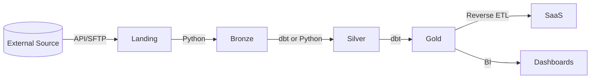

# Open Data Platform Architecture

This document defines the architectural standards for the Open Data Platform, aligned with DAMA DMBOK V2 principles.

## 1. Data Lakehouse Zones

We follow a standard Medallion Architecture (Bronze -> Silver -> Gold).

### 🟢 Landing (Raw)
- **Purpose**: Immutable landing zone for raw data files from source systems.
- **Format**: Original format (JSON, CSV, Parquet, XML).
- **Transformation**: None. 1:1 copy of source.
- **Persistence**: Transient or Archievel (depending on source).

### 🟤 Bronze (Ingested)
- **Purpose**: efficient querying and history.
- **Format**: Parquet / Delta.
- **Schema**: Source schema with additional metadata columns (`_ingested_at`, `_source_file`).
- **Transformation**: minimal (type casting only).
- **Quality Checks**: "Contract Tests" (Schema validation).

### ⚪ Silver (Refined)
- **Purpose**: Cleaned, standardized, and business-ready data.
- **Transformation**:
    - Data cleansing (deduplication, null handling).
    - Parsing complex fields (e.g. JSON extraction).
    - Standardizing definitions (e.g. currency, dates).
    - **PII masking** (if applicable).
- **Quality Checks**: Null checks, referential integrity, domain value validation.

### 🟡 Gold (Curated)
- **Purpose**: Aggregated data for Bi/Analytics.
- **Transformation**:
    - Star Schemas (Facts & Dimensions).
    - Aggregates (KPIs).
    - Business logic (Churn calculation, Revenue recognition).
- **Quality Checks**: Business rule validation.

## 2. The "Split Architecture" Pattern

Our platform uses a hybrid best-of-breed approach:

| Capability | Tool | When to use |
|------------|------|-------------|
| **Complex Logic** | **Python** | Parsing email bodies (NLP), API interaction, recursive logic, non-structured data. |
| **Set-based Transform** | **dbt (SQL)** | Joins, aggregations, renormalization, standard metrics. |
| **Orchestration** | **Make / External** | Triggering proper sequence. |

### Decision Matrix

1. **Can it be done in pure SQL?**
   - YES -> Use **dbt** (preferred for lineage & docs).
   - NO -> Use **Python**.

2. **Is it row-by-row processing (iterative)?**
   - YES -> Use **Python** (Pandas/Polars/Pyspark).
   - NO -> Use **dbt**.

## 3. Data Flow

